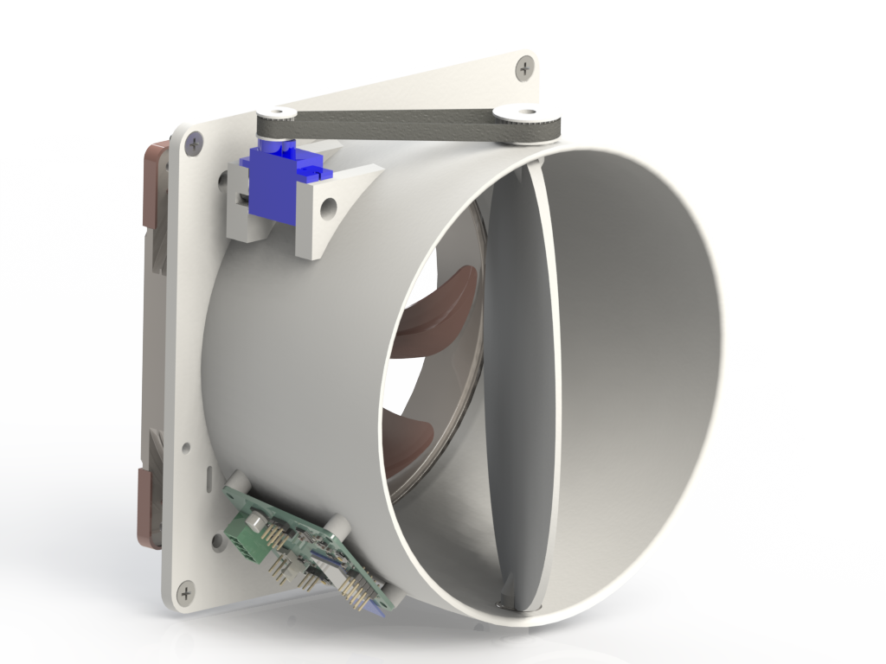

# FanBee :honeybee:
*A Zigbee-controlled 140mm fan with electronically-controlled valve*

Skip to the Build Guide if you want to know how to build one.

# Introduction

## User Interface
The small LED (D3) near the reset button indicates if the lowest (MCU) power
rail has power. If it is not illuminated nothing will happen, check power rails.

The firmware initially starts blinking its status LED (D4, near the JTAG
header) every 2 seconds, indicating that it is idle and is not connected to any
network. Press the Pair button after your ZigBee network is ready to join a new
device. The status LED will start to blink rapidly (every 0.5s) until it has
joined a network, then it will turn off.

Pressing the pair button while the device is already joined to a network will
result in two quick flashes of the status LED.

Long-pressing the pair button (>5s) will reset the device.

The last LED (D5) indicates if the fan is currently powered. It can be used
to diagnose fan or connectivity issues.

## Coordinator compatibility
Because the ZigBee HVAC fan device type is unfit for this device (it supports
various modes but no speed control) I've opted to implement it as a generic
level-controlled device (just like dimmable lights). This should give it fairly
broad coordinator compatibility.

There's a device model for the FanBee in Zigbee2MQTT which is what I'm
personally using to control them.

## Notes
* The power connector is designed for daisy-chaining, that's why there are
  two positive and negative positions. Only one of each needs to be connected
  for normal operation.
* Second Servo output is not used currently, was used in an earlier revision
  and left for any future use as there was space.
* SPI flash can be left unpopulated if you don't ever want to use OTA updates
  or maybe a later (larger) firmware. It's currently unused.
* Newer TI SDKs have been tested but drop off the Zigbee network for unknown
  reasons after hours or days. Use the pinned version.
* Make sure that the surface your're installing the base plate on is flat.
  Otherwise the bell shape gets distorted and the butterfly valve disk gets
  stuck. The tolerances there need to be relatively tight to not allow too much
  air to go through in closed state.

# Build Guide
## Requirements

### Off-the-shelf hardware
| Quantity | Part description |
| -------- | ---------------- |
| 8        | M3 brass heat-set inserts |
| 1        | M3 15mm buttonhead fastener |
| 1        | M3 10mm buttonhead fastener |
| 4        | M3 5mm fastener (ideally with integrated washer) |
| 4        | M4 countersunk fasteners for attaching the housing |
| 2        | 10x15x4mm ball bearings |
| 1        | SG90-compatible 180° servo |
| 1        | 140mm 24V or 12V PC-compatible PWM fan (plus screws if not included) |
| 30cm     | 2GT timing belt (open-loop) |

This was designed for the Noctua NF-A14 industrialPPC-24V-3000 SP IP67 PWM, but
any other electrically-compatible 24V or 12V fans can be used. Note that the
power supply voltage needs to match the fan voltage, there is no regulator for
the fan power supply.

### PCB
The control PCB is custom-designed and can be ordered at your favorite PCB
manufacturer in various states of assembly. All SMT parts can be assembled
for relatively cheap by JLCPCB. One PCB is needed for each FanBee.

A OpenOCD and JTAG compatible programmer with a 2.45mm ARM 10 Pin JTAG
connector is required. This has been tested with a generic FT2232 board, but
a TI XDS110 or compatible LaunchPad should also work.

### Printed parts
The STLs for all printed parts are in the `parts` folder. One of each is
needed for a single fanbee.
`servo_pulley.stl` should be printed in resin or with a 0.2mm nozzle, the
rest of the parts do not need to be as precise.

## Assembly steps
1. Insert the 4 heat-set inserts into the studs for holding the PCB.
2. Insert the two heat-set inserts into the base for holding an optional PCB enclosure.
3. Insert a heat-set insert each into the bottom and top holes of the valve disk.
4. Press both ball bearings into their housings on the main part.
5. Place the fan at the back, route the wires through the slot and attach it with four fan screws.
6. Route the servo cables through the hole and attach the servo with two screws.
7. Attach the PCB with four 5mm screws.
8. Connect the 4-pin fan connector and 3-pin servo connector.
9. Place the fan disk between the bearings and push in the retaining pin from the bottom and the disk pulley from the top.
10. Secure the retaining pin with the 10mm M3 screw.
11. Secure the disk pulley with the 15mm M3 screw.
12. Push the servo pulley onto the servo and secure it with the provided screw.
13. Cut a sufficiently-long section of belt, loop it around the two servos and secure both ends with the belt retainer.
15. Attach the JTAG programmer and temporary power and flash the firmware.

## Future work
* Public CI for firmware and manufacturing files
* Render/photos of the finished product

# License
MIT for all the code I wrote as well as the CAD design files. Some code is also
related to TI's SimpleLink SDK (especially the generated syscfg), I don't claim
ownership of that, but TI grants you relatively broad permissions for most use.
